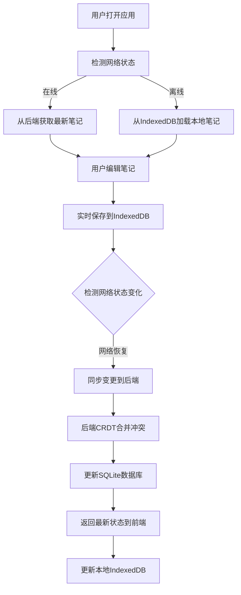

# 离线同步笔记应用 - 产品需求文档

## 1. 产品概述

本应用是一个支持离线编辑和在线同步的笔记工具，使用CRDT（无冲突复制数据类型）技术解决多端编辑冲突问题。

- 核心目的：提供可靠的离线编辑体验，确保网络恢复后数据能够自动同步并正确合并
- 目标用户：需要经常离线工作、多设备编辑笔记的用户群体
- 产品价值：解决传统同步工具在离线编辑时的数据冲突问题，提供无缝的跨设备编辑体验

## 2. 核心功能

### 2.1 Feature Module

1. **笔记编辑器页面**：富文本编辑器、实时保存、网络状态指示
2. **笔记列表页面**：笔记概览、创建/删除笔记、同步状态显示

### 2.2 Page Details

| 页面名称 | 模块名称 | 功能描述 |
|-----------|-------------|---------------------|
| 笔记编辑器 | 文本编辑器 | 支持基本文本编辑，实时显示编辑状态 |
| 笔记编辑器 | IndexedDB存储 | 编辑内容实时保存到本地IndexedDB |
| 笔记编辑器 | 网络状态检测 | 实时显示在线/离线状态，自动触发同步 |
| 笔记列表 | 笔记管理 | 创建、删除、查看笔记列表 |
| 笔记列表 | 同步状态 | 显示各笔记的同步状态 |

## 3. 核心流程

## 4. 用户界面设计

### 4.1 Design Style

- **主色调**：深蓝色系 (#165DFF)，代表专业和可靠
- **辅助色**：绿色 (#00B42A) 表示在线/已同步，橙色 (#FF7D00) 表示同步中，红色 (#F53F3F) 表示离线
- **按钮风格**：圆角设计，悬停时有轻微放大和阴影效果
- **字体**：使用现代无衬线字体，标题使用粗体，正文使用常规字重
- **布局风格**：简洁的卡片式布局，左侧笔记列表，右侧编辑器
- **图标风格**：线性图标，保持简洁统一

### 4.2 Page Design Overview

| 页面名称 | 模块名称 | UI Elements |
|-----------|-------------|-------------|
| 笔记编辑器 | 顶部栏 | 笔记标题、网络状态指示器、保存状态提示 |
| 笔记编辑器 | 编辑区域 | 大文本编辑框，支持自动换行，有打字机效果动画 |
| 笔记编辑器 | 底部栏 | 字符计数、最后同步时间 |
| 笔记列表 | 侧边栏 | 笔记卡片列表，每张卡片显示标题、预览、同步状态 |
| 笔记列表 | 顶部操作 | 新建笔记按钮、搜索框 |

### 4.3 Responsiveness

- **Desktop-first**：优先适配桌面端
- **移动端适配**：小屏幕下单列布局，笔记列表可折叠
- **触摸优化**：按钮和点击区域最小48x48px，确保触摸友好

## 5. 核心技术特性

1. **离线优先架构**：所有操作首先在本地执行，确保离线可用
2. **CRDT冲突解决**：使用Yjs实现无冲突的数据合并
3. **实时同步**：网络恢复时自动同步本地变更
4. **增量更新**：只同步变更内容，减少数据传输
