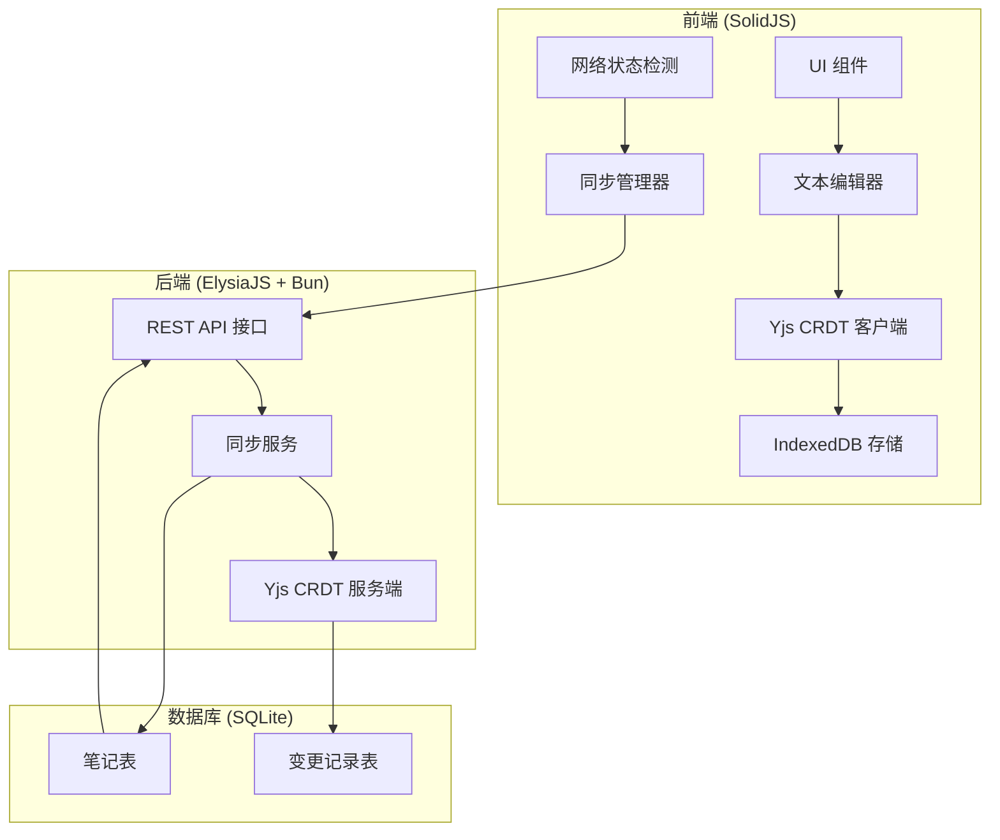
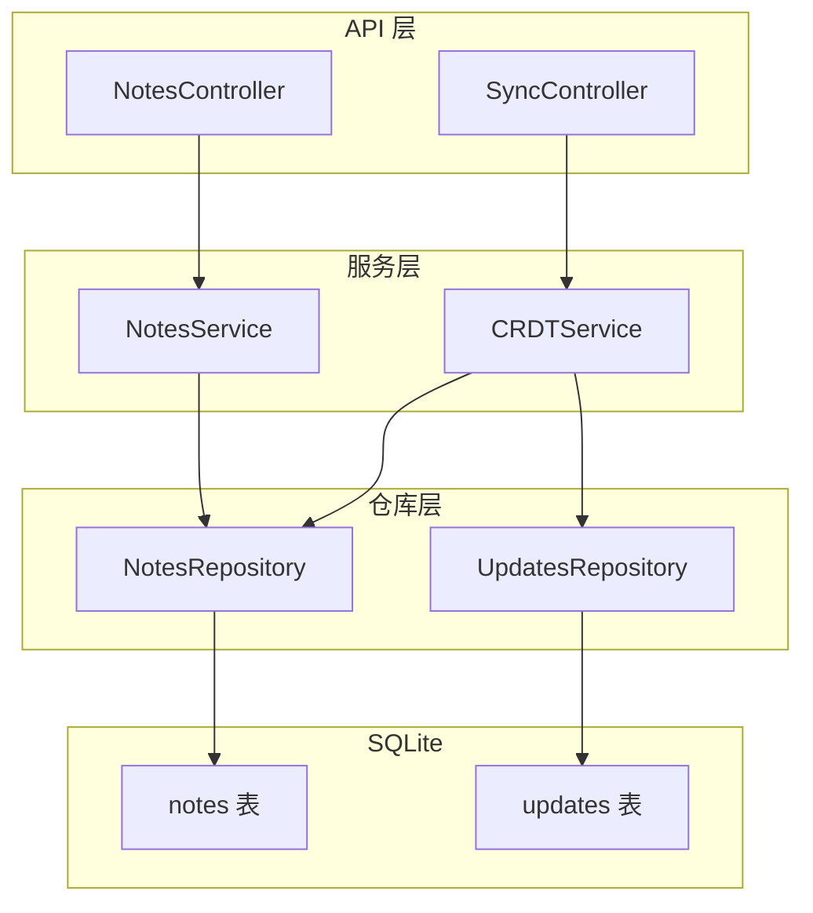
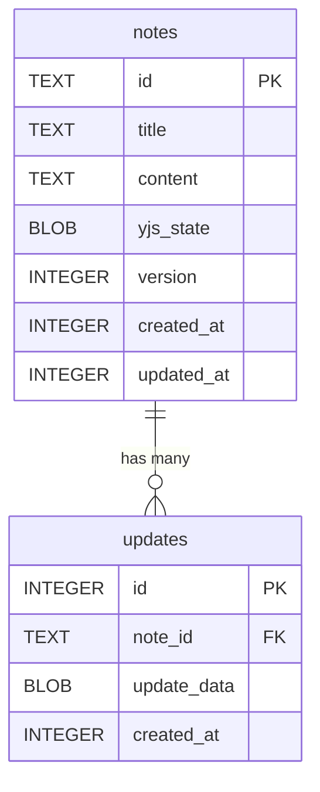

# 离线同步笔记应用 - 技术架构文档

## 1. 架构设计



## 2. Technology Description

### 前端技术栈
- **框架**: SolidJS (编译型响应式框架，性能优异)
- **构建工具**: Vite
- **样式**: TailwindCSS
- **CRDT库**: Yjs (成熟的CRDT实现)
- **本地存储**: IndexedDB (通过y-indexeddb)
- **状态管理**: SolidJS 内置响应式状态

### 后端技术栈
- **框架**: ElysiaJS (Bun 环境下的高性能 Web 框架)
- **运行时**: Bun
- **数据库**: SQLite (通过 bun:sqlite)
- **CRDT支持**: Yjs 服务端实现

## 3. Route Definitions

| 路由 | 方法 | 用途 |
|-------|------|---------|
| / | GET | 应用首页 - 笔记编辑器 |
| /notes | GET | 笔记列表页面 |
| /notes/:id | GET | 单个笔记编辑器 |

## 4. API Definitions

### 类型定义

```typescript
interface Note {
  id: string;
  title: string;
  content: string;
  createdAt: number;
  updatedAt: number;
  yjsUpdate: Uint8Array;
}

interface SyncRequest {
  noteId: string;
  updates: Uint8Array[];
  baseVersion: number;
}

interface SyncResponse {
  noteId: string;
  updates: Uint8Array[];
  latestVersion: number;
  success: boolean;
}
```

### API 端点

#### GET /api/notes
获取所有笔记列表

**响应**:
```typescript
{
  notes: Array<{
    id: string;
    title: string;
    updatedAt: number;
  }>
}
```

#### GET /api/notes/:id
获取单个笔记的最新状态

**响应**:
```typescript
{
  id: string;
  title: string;
  content: string;
  yjsState: Uint8Array;
  version: number;
  updatedAt: number;
}
```

#### POST /api/notes
创建新笔记

**请求体**:
```typescript
{
  title: string;
  initialContent?: string;
}
```

#### POST /api/notes/:id/sync
同步笔记变更

**请求体**:
```typescript
{
  updates: number[];  // Uint8Array 序列化
  clientVersion: number;
}
```

**响应**:
```typescript
{
  success: boolean;
  serverUpdates: number[];
  serverVersion: number;
}
```

## 5. Server Architecture Diagram



## 6. Data Model

### 6.1 Data Model Definition



### 6.2 Data Definition Language

```sql
-- 笔记表
CREATE TABLE IF NOT EXISTS notes (
  id TEXT PRIMARY KEY,
  title TEXT NOT NULL DEFAULT '',
  content TEXT NOT NULL DEFAULT '',
  yjs_state BLOB,
  version INTEGER NOT NULL DEFAULT 0,
  created_at INTEGER NOT NULL,
  updated_at INTEGER NOT NULL
);

-- 变更记录表
CREATE TABLE IF NOT EXISTS updates (
  id INTEGER PRIMARY KEY AUTOINCREMENT,
  note_id TEXT NOT NULL,
  update_data BLOB NOT NULL,
  created_at INTEGER NOT NULL,
  FOREIGN KEY (note_id) REFERENCES notes(id) ON DELETE CASCADE
);

-- 索引
CREATE INDEX IF NOT EXISTS idx_notes_updated_at ON notes(updated_at DESC);
CREATE INDEX IF NOT EXISTS idx_updates_note_id ON updates(note_id);
```

## 7. 目录结构

```
e15/
├── frontend/                 # 前端项目
│   ├── src/
│   │   ├── components/      # 组件
│   │   ├── hooks/           # SolidJS hooks
│   │   ├── utils/           # 工具函数
│   │   ├── types/           # 类型定义
│   │   ├── store/           # 状态管理
│   │   └── App.tsx
│   ├── package.json
│   └── vite.config.ts
├── backend/                  # 后端项目
│   ├── src/
│   │   ├── controllers/     # 控制器
│   │   ├── services/        # 服务层
│   │   ├── repositories/    # 仓库层
│   │   ├── db/              # 数据库
│   │   ├── types/           # 类型定义
│   │   └── index.ts
│   ├── package.json
│   └── tsconfig.json
└── shared/                   # 共享类型
    └── types.ts
```
