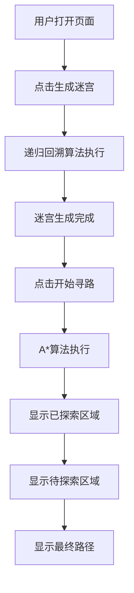

## 1. 产品概述
迷宫生成与寻路算法可视化工具，用于直观展示递归回溯迷宫生成算法和 A* 寻路算法的执行过程。
- 主要目的：通过可视化方式帮助用户理解迷宫生成和寻路算法的工作原理
- 目标用户：计算机科学学习者、算法爱好者、教育工作者

## 2. 核心功能

### 2.1 用户角色
| 角色 | 注册方式 | 核心权限 |
|------|---------|---------|
| 普通用户 | 无需注册 | 使用所有功能，查看算法可视化过程 |

### 2.2 功能模块
1. **主页面**：Canvas 画布区域、控制面板按钮、算法说明

### 2.3 页面详情
| 页面名称 | 模块名称 | 功能描述 |
|---------|---------|---------|
| 主页面 | Canvas 画布区域 | 20x20 网格迷宫显示，支持颜色标记不同状态 |
| 主页面 | 控制面板 | "生成迷宫"按钮、"开始寻路"按钮 |
| 主页面 | 状态显示 | 显示当前算法执行状态 |

## 3. 核心流程
用户打开页面 → 点击"生成迷宫"按钮 → 递归回溯算法可视化生成迷宫 → 点击"开始寻路"按钮 → A* 算法可视化寻路 → 显示最终路径

## 4. 用户界面设计

### 4.1 设计风格
- 主色调：深蓝色 (#1e3a8a) 作为主色，代表科技与专业
- 辅助色：
  - 墙壁：深灰色 (#374151)
  - 通道：白色 (#f9fafb)
  - 已探索区域：浅蓝色 (#93c5fd)
  - 待探索区域：橙色 (#fbbf24)
  - 最终路径：绿色 (#34d399)
  - 起点/终点：紫色 (#8b5cf6)
- 按钮风格：圆角设计，带有悬停动画效果
- 字体：使用现代无衬线字体，清晰易读
- 布局风格：上下布局，上方为画布区域，下方为控制面板
- 图标风格：简洁的扁平化图标

### 4.2 页面设计概述
| 页面名称 | 模块名称 | UI 元素 |
|---------|---------|---------|
| 主页面 | Canvas 画布 | 20x20 网格，颜色标记，平滑过渡动画 |
| 主页面 | 控制面板 | 两个主要按钮，状态文字，间距适中 |
| 主页面 | 图例说明 | 颜色与对应状态的说明 |

### 4.3 响应性
- 桌面端优先，支持主流分辨率
- Canvas 区域自适应容器大小
- 控制面板在小屏幕上垂直堆叠

## 5. 动画与交互
- 迷宫生成过程：逐步显示墙壁移除过程，每步有短暂延迟
- 寻路过程：逐步标记探索区域，展示算法决策过程
- 按钮交互：悬停缩放效果，点击反馈
- 颜色过渡：状态变化时有平滑的颜色过渡
