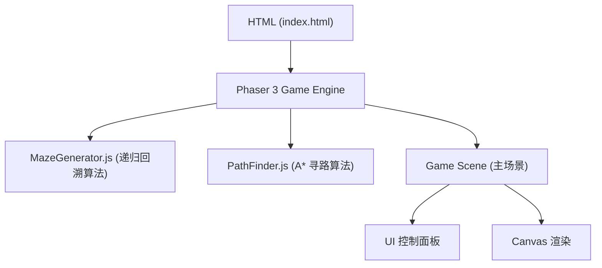

## 1. 架构设计



## 2. 技术说明

- 前端技术栈：
  - Phaser 3 (游戏引擎，负责 Canvas 渲染和交互)
  - 原生 HTML/CSS/JavaScript
  - 无构建工具，直接在浏览器运行

- 核心算法文件：
  - MazeGenerator.js：封装递归回溯迷宫生成算法
  - PathFinder.js：封装 A* 寻路算法

## 3. 文件结构

```
e16/
├── index.html          # 主页面文件
├── js/
│   ├── MazeGenerator.js  # 迷宫生成算法
│   ├── PathFinder.js    # A* 寻路算法
│   └── main.js          # Phaser 游戏主逻辑
└── css/
    └── style.css         # 样式文件
```

## 4. 核心类定义

### 4.1 MazeGenerator 类
```javascript
class MazeGenerator {
  constructor(width, height) {
    this.width = width;
    this.height = height;
    this.grid = [];
  }
  
  generate() {
    // 递归回溯算法实现
  }
  
  getMazeData() {
    // 返回迷宫数据
  }
}
```

### 4.2 PathFinder 类
```javascript
class PathFinder {
  constructor(mazeData) {
    this.maze = mazeData;
    this.openSet = [];
    this.closedSet = [];
  }
  
  findPath(start, end) {
    // A* 算法实现
  }
  
  heuristic(a, b) {
    // 曼哈顿距离
  }
}
```

## 5. 主要功能实现

### 5.1 迷宫数据结构
- 使用二维数组表示迷宫网格
- 每个单元格包含墙壁信息（上、下、左、右）
- 单元格状态：墙壁/通道

### 5.2 可视化实现
- Phaser.Graphics 绘制网格
- 不同状态使用不同颜色
- 使用 setTimeout 控制动画速度
- 事件驱动更新显示

### 5.3 寻路状态
- 待探索（openSet）：橙色
- 已探索（closedSet）：浅蓝色
- 最终路径：绿色

## 6. 性能考虑
- 20x20 网格，总计 400 个单元格
- 动画帧间隔控制在 20-50ms 之间
- 避免频繁 DOM 操作
- 使用 Phaser 内置渲染优化
