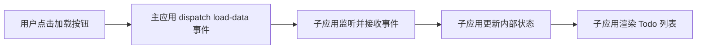

## 1. 产品概述
基于 Web Components 的微前端系统，实现主应用与子应用的解耦开发与部署
- 主应用负责路由管理和子应用加载，子应用作为独立组件提供具体业务功能
- 通过 CustomEvent 实现跨应用通信，支持独立开发、测试和部署

## 2. 核心功能

### 2.1 功能模块
1. **主应用 (Container)**: 路由管理、子应用加载器、通信中枢
2. **子应用 (Todo Widget)**: 待办事项列表、状态管理、事件监听

### 2.2 页面详情
| 页面名称 | 模块名称 | 功能描述 |
|-----------|-------------|---------------------|
| 主应用页面 | 导航栏 | 路由切换按钮、数据加载按钮 |
| 主应用页面 | 子应用容器 | <micro-frontend> 自定义标签区域 |
| 子应用组件 | Todo 列表 | 展示待办事项、支持增删改查 |
| 子应用组件 | 状态指示器 | 显示数据加载状态 |

## 3. 核心流程

用户在主应用点击"加载数据"按钮 → 主应用触发 load-data CustomEvent → 子应用监听并接收事件 → 子应用更新内部状态 → 子应用渲染 Todo 列表

## 4. 用户界面设计

### 4.1 设计风格
- **主色调**: 深蓝色 (#165DFF) 作为主色，浅蓝渐变作为背景
- **按钮风格**: 圆角 8px，悬停时有轻微上浮效果和阴影
- **字体**: 使用 'Inter' 作为主字体，标题使用 'Poppins'
- **布局风格**: 卡片式布局，主应用采用顶部导航 + 内容区域
- **图标风格**: 使用 Font Awesome 线性图标

### 4.2 页面设计概述
| 页面名称 | 模块名称 | UI 元素 |
|-----------|-------------|-------------|
| 主应用页面 | 导航栏 | 渐变背景、悬浮按钮、平滑过渡动画 |
| 主应用页面 | 容器区域 | 卡片阴影、边框动画、淡入效果 |
| 子应用组件 | Todo 列表 | 交错动画、滑动删除、完成标记 |

### 4.3 响应式
桌面优先设计，适配平板和移动端。主应用导航在移动端转为汉堡菜单，子应用自适应容器宽度。
