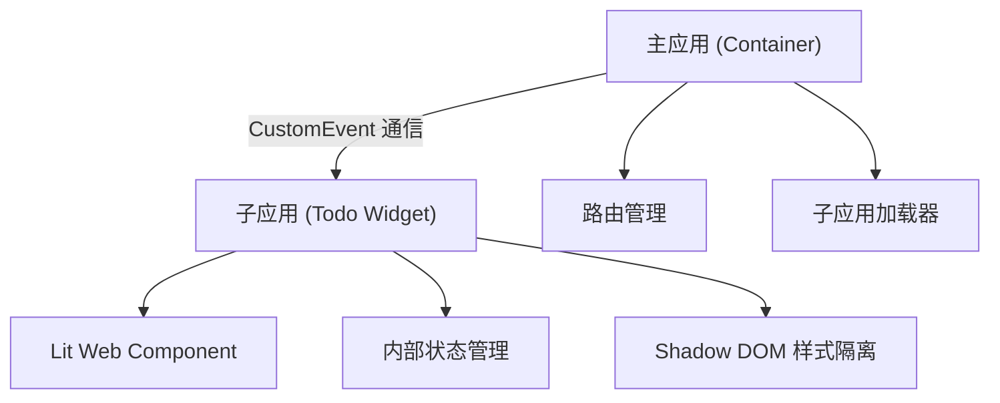

## 1. 架构设计



## 2. 技术描述

- **主应用**: 原生 HTML + Vanilla JavaScript，无框架依赖
- **子应用**: Lit@3.x (轻量级 Web Components 框架)
- **构建工具**: Vite@5.x
- **样式隔离**: Shadow DOM
- **通信机制**: CustomEvent API

## 3. 项目结构

| 文件路径 | 用途 |
|-------|---------|
| `/index.html` | 主应用入口页面 |
| `/main.js` | 主应用逻辑、路由、自定义标签定义 |
| `/widget/todo-widget.js` | 子应用 Todo Web Component |
| `/package.json` | 项目依赖配置 |
| `/vite.config.js` | Vite 构建配置 |

## 4. 通信协议

### 4.1 主应用 → 子应用 (load-data)
```javascript
// 事件定义
const event = new CustomEvent('load-data', {
  detail: {
    todos: [
      { id: 1, text: '学习 Web Components', completed: false },
      { id: 2, text: '实现微前端', completed: true }
    ]
  },
  bubbles: true,
  composed: true
});
```

### 4.2 子应用 → 主应用 (data-loaded)
```javascript
// 事件定义
const event = new CustomEvent('data-loaded', {
  detail: {
    status: 'success',
    count: 2
  },
  bubbles: true,
  composed: true
});
```

## 5. 自定义标签定义

### 5.1 `<micro-frontend>` 主应用标签
```javascript
class MicroFrontend extends HTMLElement {
  connectedCallback() {
    // 渲染子应用容器
    // 建立事件监听
  }
}
customElements.define('micro-frontend', MicroFrontend);
```

### 5.2 `<todo-widget>` 子应用标签
```javascript
class TodoWidget extends LitElement {
  static properties = {
    todos: { type: Array }
  };
  
  connectedCallback() {
    super.connectedCallback();
    this.addEventListener('load-data', this.handleLoadData);
  }
}
customElements.define('todo-widget', TodoWidget);
```

## 6. 样式隔离策略

- 子应用使用 Shadow DOM 确保样式不与主应用冲突
- 使用 CSS 变量实现主题定制
- 主应用使用全局样式，不影响 Shadow DOM 内部
