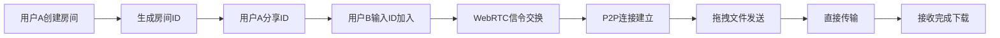

# P2P文件传输应用 - 产品需求文档

## 1. 产品概述
基于WebRTC技术的浏览器端P2P文件传输应用，实现用户间直接文件传输，无需服务器中转。
- 解决大文件传输慢、服务器带宽成本高的问题
- 目标用户：需要快速分享文件的个人用户和团队

## 2. 核心功能

### 2.1 用户角色
| 角色 | 注册方式 | 核心权限 |
|------|----------|----------|
| 普通用户 | 无需注册 | 创建房间、加入房间、发送/接收文件 |

### 2.2 功能模块
1. **主页面**：房间创建/加入区域、连接状态显示、文件传输区域
2. **文件传输组件**：拖拽上传、传输进度、文件列表

### 2.3 页面详情
| 页面名称 | 模块名称 | 功能描述 |
|-----------|-------------|---------------------|
| 主页面 | 房间管理 | 创建房间生成唯一ID，输入ID加入房间 |
| 主页面 | 连接状态 | 显示WebSocket连接状态、WebRTC连接状态 |
| 主页面 | 文件传输 | 拖拽上传文件，显示传输进度，支持多文件 |

## 3. 核心流程

用户A创建房间 → 生成房间ID → 用户B输入ID加入 → WebRTC握手建立连接 → 拖拽文件发送 → 直接P2P传输 → 接收完成下载

## 4. 用户界面设计

### 4.1 设计风格
- 主色调：深蓝色 (#165DFF)，体现科技感和可靠性
- 辅助色：绿色 (#00B42A) 表示成功，橙色 (#FF7D00) 表示进度
- 按钮风格：圆角设计，微阴影，hover时有轻微放大效果
- 字体：现代无衬线字体，清晰易读
- 布局风格：卡片式布局，分区明确，留白充足
- 图标风格：简约线性图标

### 4.2 页面设计概述
| 页面名称 | 模块名称 | UI 元素 |
|-----------|-------------|-------------|
| 主页面 | 房间管理 | 两个并列卡片，创建房间和加入房间按钮，ID输入框 |
| 主页面 | 连接状态 | 状态指示器（圆点颜色变化），状态文字描述 |
| 主页面 | 文件区域 | 虚线边框拖拽区域，文件列表卡片，进度条 |

### 4.3 响应式
- Desktop-first 设计
- 移动端自适应，卡片堆叠显示
- 触摸操作优化，按钮尺寸适合点击

