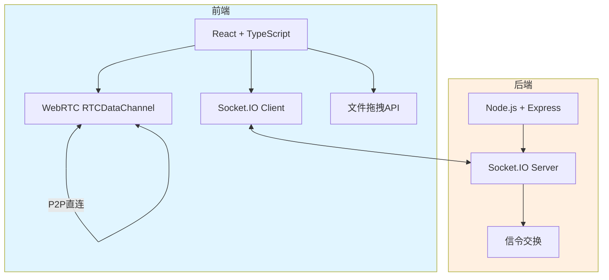
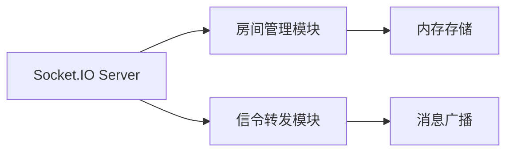

# P2P文件传输应用 - 技术架构文档

## 1. 架构设计



## 2. 技术描述

- **前端**：React@18 + TypeScript + Vite + TailwindCSS
- **初始化工具**：Vite
- **后端**：Node.js + Express@4 + Socket.IO@4
- **数据库**：无需数据库，内存存储房间状态
- **核心技术**：WebRTC (RTCPeerConnection + RTCDataChannel)

## 3. 路由定义

### 前端路由
| 路由 | 用途 |
|-------|---------|
| / | 主页面 - 房间管理和文件传输 |

### 后端路由
| 路由 | 用途 |
|-------|---------|
| / | API健康检查 |
| /socket.io | Socket.IO信令端点 |

## 4. API 定义

### Socket.IO 事件

```typescript
// 客户端发送事件
interface ClientToServerEvents {
  'create-room': () => void;
  'join-room': (roomId: string) => void;
  'offer': (data: { roomId: string; offer: RTCSessionDescriptionInit }) => void;
  'answer': (data: { roomId: string; answer: RTCSessionDescriptionInit }) => void;
  'ice-candidate': (data: { roomId: string; candidate: RTCIceCandidateInit }) => void;
}

// 服务端发送事件
interface ServerToClientEvents {
  'room-created': (roomId: string) => void;
  'room-joined': (roomId: string) => void;
  'room-full': () => void;
  'room-not-found': () => void;
  'user-joined': () => void;
  'offer': (offer: RTCSessionDescriptionInit) => void;
  'answer': (answer: RTCSessionDescriptionInit) => void;
  'ice-candidate': (candidate: RTCIceCandidateInit) => void;
}
```

### 传输协议

```typescript
// 文件传输消息格式
interface FileMessage {
  type: 'file-info' | 'file-chunk' | 'file-complete';
  fileName?: string;
  fileSize?: number;
  fileType?: string;
  chunkIndex?: number;
  totalChunks?: number;
  data?: ArrayBuffer;
}
```

## 5. 服务端架构



## 6. 核心模块说明

### 6.1 信令服务器
- 管理房间创建和加入
- 转发WebRTC SDP offer/answer
- 转发ICE候选信息
- 限制每个房间最多2人

### 6.2 WebRTC连接管理
- RTCPeerConnection建立
- ICE候选收集
- RTCDataChannel创建
- 连接状态监控

### 6.3 文件传输
- 文件分片（16KB/chunk）
- 传输进度计算
- 文件重组和下载
- 错误处理和重试

