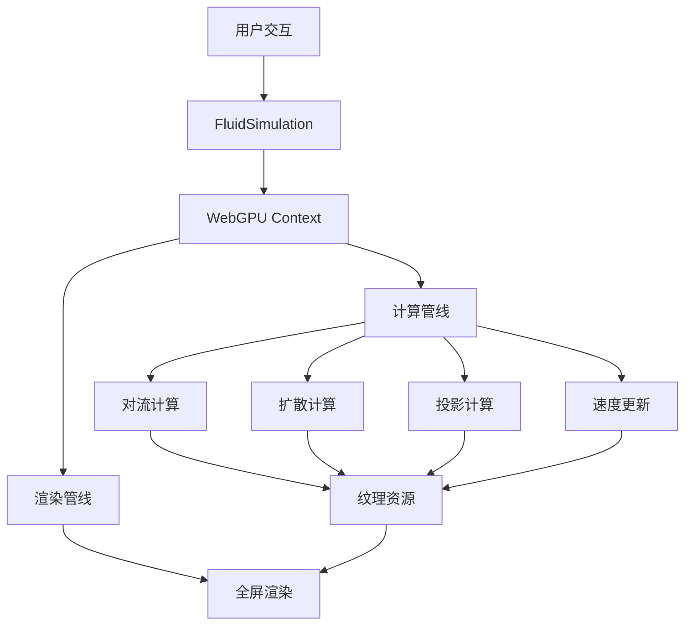

# 2D流体模拟技术架构文档

## 1. 技术选型决策

### 1.1 WebGPU vs WebGL
选择WebGPU的原因：
- 现代API设计，更好的性能
- 计算着色器支持，适合GPGPU任务
- 显式资源管理，更可控
- 未来浏览器的标准方向

### 1.2 TypeScript
- 强类型支持，减少运行时错误
- 更好的IDE支持和代码补全
- 便于维护和重构

### 1.3 Vite
- 快速的开发服务器
- 原生ES模块支持
- 简化的构建配置

## 2. 系统架构

### 2.1 整体架构图



### 2.2 核心模块

#### 2.2.1 FluidSimulation 类
负责：
- 初始化WebGPU上下文
- 管理所有计算和渲染管线
- 协调模拟步骤
- 处理用户输入

#### 2.2.2 计算着色器
- **advection.wgsl**: 使用半拉格朗日方法对流速度和密度
- **diffusion.wgsl**: 雅可比迭代求解扩散
- **projection.wgsl**: 计算散度和求解压力泊松方程
- **velocity_update.wgsl**: 应用压力梯度使速度无散度

#### 2.2.3 渲染着色器
- **render.wgsl**: 将密度场或速度场映射为颜色

## 3. 流体模拟算法

### 3.1 Navier-Stokes方程简化
我们实现不可压缩流体的简化版本：

**速度更新**:
```
u = advect(u)
u = diffuse(u, viscosity)
u = project(u)  // 确保无散度
```

**密度更新**:
```
d = advect(d)
d = diffuse(d, diffusion_rate)
```

### 3.2 算法步骤

每帧执行以下步骤：
1. 添加用户输入的力和染料
2. 速度场对流
3. 速度场扩散
4. 计算速度场散度
5. 求解压力泊松方程
6. 应用压力梯度投影速度场
7. 密度场对流
8. 密度场扩散
9. 渲染结果

## 4. WebGPU资源管理

### 4.1 纹理（Textures）
使用ping-pong技术进行计算：
- velocity_0, velocity_1: 速度场纹理对
- density_0, density_1: 密度场纹理对
- pressure_0, pressure_1: 压力场纹理对
- divergence: 散度纹理

### 4.2 缓冲区（Buffers）
- uniform buffer: 模拟参数（时间、dt、分辨率等）
- mouse buffer: 鼠标位置和力

### 4.3 绑定组（Bind Groups）
每个计算着色器有自己的绑定组，包含输入输出纹理和uniforms。

## 5. 数据结构

### 5.1 模拟参数
```typescript
interface SimulationParams {
  dt: number;
  resolution: [number, number];
  viscosity: number;
  diffusion: number;
  pressureIterations: number;
  mouseForce: number;
  mouseRadius: number;
}
```

### 5.2 鼠标状态
```typescript
interface MouseState {
  position: [number, number];
  delta: [number, number];
  isDown: boolean;
}
```

## 6. 性能优化策略

### 6.1 GPU优化
- 使用纹理数组减少绑定组切换
- 合理的工作组大小（如8x8）
- 避免CPU-GPU数据传输

### 6.2 算法优化
- 使用快速的半拉格朗日对流
- 限制雅可比迭代次数（通常20-40次）
- 适当的网格分辨率（256x256或512x512）

### 6.3 渲染优化
- 使用全屏三角形而非两个三角形
- 简单的片元着色器

## 7. 浏览器兼容性

- Chrome 113+
- Edge 113+
- Firefox 113+（需要开启标志）
- Safari 16.4+

## 8. 构建和部署

### 8.1 开发命令
```bash
npm install
npm run dev
```

### 8.2 生产构建
```bash
npm run build
```
