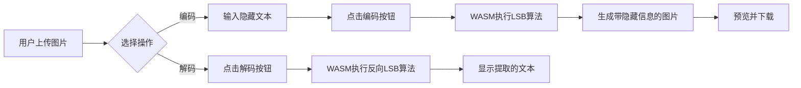

## 1. 产品概述

图片隐写Web应用 - 允许用户在浏览器中将文本信息隐藏到PNG图片中，也可以从已隐藏信息的图片中提取文本。

- 主要目的：提供简单易用的图片隐写工具，保护敏感信息或实现数字水印
- 解决问题：无需安装复杂软件，在浏览器中即可完成图片隐写操作
- 目标用户：需要隐藏/传递敏感信息的用户、安全研究人员、数字内容创作者
- 产品价值：简单、安全、跨平台的图片隐写解决方案

## 2. 核心功能

### 2.1 用户角色
| 角色 | 注册方式 | 核心权限 |
|------|----------|----------|
| 普通用户 | 无需注册 | 使用编码和解码功能 |

### 2.2 功能模块
1. **主页面**: 图片上传、文本输入、编码/解码操作、结果展示

### 2.3 页面详情
| 页面名称 | 模块名称 | 功能描述 |
|-----------|-------------|---------------------|
| 主页面 | 图片上传 | 支持拖拽和点击上传PNG图片 |
| 主页面 | 文本输入 | 输入要隐藏到图片中的文本信息 |
| 主页面 | 编码功能 | 使用LSB算法将文本隐藏到图片蓝色通道 |
| 主页面 | 解码功能 | 从图片中提取隐藏的文本信息 |
| 主页面 | 结果展示 | 显示处理后的图片预览和提取的文本 |
| 主页面 | 下载功能 | 下载已隐藏信息的PNG图片 |

## 3. 核心流程

### 3.1 编码流程
用户上传PNG图片 → 输入要隐藏的文本 → 点击"编码"按钮 → WASM执行LSB算法 → 生成带隐藏信息的图片 → 预览和下载图片

### 3.2 解码流程
用户上传含隐藏信息的PNG图片 → 点击"解码"按钮 → WASM执行反向LSB算法 → 提取并显示隐藏的文本

## 4. 用户界面设计

### 4.1 设计风格
- 主色调：深蓝色系 (#1e3a8a, #3b82f6) - 传达安全和专业感
- 辅助色：青绿色 (#10b981) - 用于成功状态和操作按钮
- 警告色：橙红色 (#f59e0b) - 用于警告和错误提示
- 按钮风格：圆角、微渐变、悬停时有微妙的缩放和阴影效果
- 字体：使用现代无衬线字体 - Inter 或类似字体
- 布局风格：卡片式布局，清晰的视觉层次，充足的留白
- 图标风格：简洁的线性图标，与整体风格统一

### 4.2 页面设计概述
| 页面名称 | 模块名称 | UI 元素 |
|-----------|-------------|----------|
| 主页面 | 头部 | Logo、标题、简短说明 |
| 主页面 | 上传区域 | 拖拽框、文件选择按钮、图片预览 |
| 主页面 | 文本输入 | 文本域、字符计数提示 |
| 主页面 | 操作区 | 编码按钮、解码按钮、加载动画 |
| 主页面 | 结果区 | 处理后图片预览、提取的文本、下载按钮 |
| 主页面 | 页脚 | 技术说明、版权信息 |

### 4.3 响应式设计
- Desktop-first 设计，适配主流桌面分辨率
- 移动端适配：堆叠布局，优化触摸区域
- 平板适配：流式布局，自适应卡片宽度

### 4.4 动画与交互
- 页面加载时的渐入动画
- 拖拽上传时的边框高亮效果
- 按钮悬停和点击的微动画
- 处理过程中的加载动画
- 结果展示时的淡入效果
