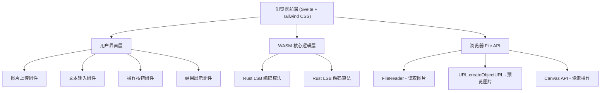

## 1. 架构设计



## 2. 技术说明

- **前端**: Svelte@4 + Vite@5 + Tailwind CSS@3
- **核心算法**: Rust + wasm-bindgen + wasm-pack
- **图片处理**: 浏览器 Canvas API
- **文件处理**: 浏览器 FileReader API
- **构建工具**: Vite
- **无后端架构**: 所有处理在浏览器端完成，无需后端服务

## 3. 项目结构

```
e26/
├── src/
│   ├── lib/
│   │   └── steganography/        # Rust WASM 模块
│   │       ├── src/
│   │       │   └── lib.rs        # LSB 编码/解码实现
│   │       ├── Cargo.toml
│   │       └── pkg/              # 编译后的 WASM 文件
│   ├── components/
│   │   ├── ImageUpload.svelte    # 图片上传组件
│   │   ├── TextInput.svelte      # 文本输入组件
│   │   ├── ActionButtons.svelte  # 操作按钮组件
│   │   └── ResultDisplay.svelte  # 结果展示组件
│   ├── App.svelte                # 主应用组件
│   ├── main.js                   # 入口文件
│   └── app.css                   # 全局样式
├── index.html
├── package.json
├── vite.config.js
├── tailwind.config.js
└── Cargo.toml                    # Rust 工作空间配置
```

## 4. 核心算法说明

### 4.1 LSB 编码算法
1. 读取PNG图片的RGBA像素数据
2. 将文本转换为二进制数据（UTF-8编码）
3. 在二进制数据前添加长度前缀（4字节，32位）
4. 遍历每个像素，将二进制数据逐位替换到蓝色通道的最低有效位
5. 返回处理后的像素数据

### 4.2 LSB 解码算法
1. 读取PNG图片的RGBA像素数据
2. 提取前32位（4字节）获取隐藏数据的长度
3. 根据长度继续提取相应位数的二进制数据
4. 将二进制数据转换为UTF-8文本

## 5. WASM 接口定义

```rust
// 编码接口
#[wasm_bindgen]
pub fn encode_message(pixels: &mut [u8], width: u32, height: u32, message: &str) -> Result<(), JsValue>

// 解码接口
#[wasm_bindgen]
pub fn decode_message(pixels: &[u8], width: u32, height: u32) -> Result<String, JsValue>
```

## 6. 前端状态管理

```javascript
// 主要状态
{
  // 上传的原始图片
  originalImage: File | null,
  // 图片预览URL
  imagePreview: string | null,
  // 图片尺寸
  imageDimensions: { width: number, height: number } | null,
  // 要隐藏的文本
  message: string,
  // 解码出的文本
  decodedMessage: string | null,
  // 处理后的图片
  processedImage: string | null,
  // 是否正在处理
  isProcessing: boolean,
  // 错误信息
  error: string | null
}
```

## 7. 性能考虑

- 图片大小限制：建议不超过 2048x2048 像素
- 文本长度限制：(width * height) / 8 - 4 字节
- 大图片处理时显示加载动画
- 使用 Web Workers 避免阻塞主线程（可选优化）
