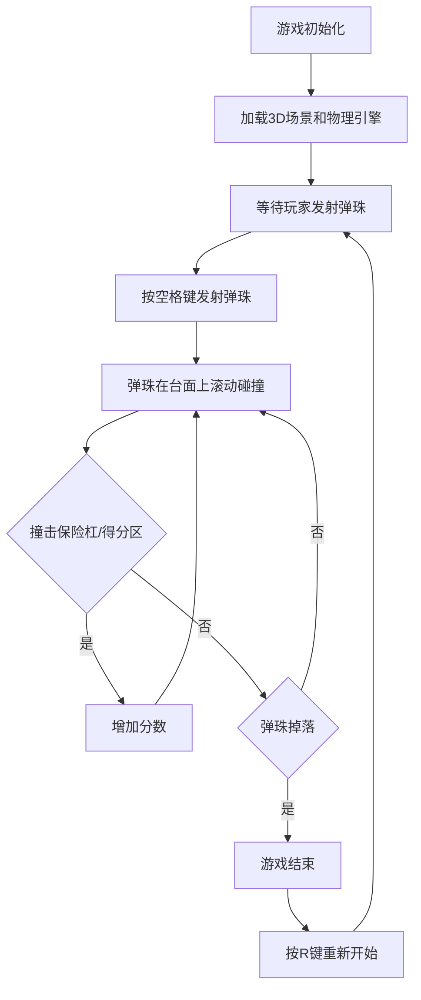

## 1. 产品概述

3D弹珠台游戏是一款基于Three.js和物理引擎开发的经典街机风格游戏。玩家通过控制挡板将弹珠弹向台面，撞击保险杠和得分区获取高分。
- 核心目的：提供沉浸式的3D弹珠游戏体验，还原真实物理碰撞效果
- 目标用户：休闲游戏玩家、物理引擎爱好者、Three.js学习者

## 2. 核心功能

### 2.1 功能模块

1. **游戏主场景**：3D弹珠台、弹珠、物理引擎
2. **控制系统**：键盘控制挡板、弹珠发射
3. **得分系统**：保险杠得分、得分区检测、分数显示

### 2.2 页面详情

| 页面名称 | 模块名称 | 功能描述 |
|-----------|-------------|---------------------|
| 游戏主页面 | 3D场景渲染 | 弹珠台3D渲染，物理引擎实时计算 |
| 游戏主页面 | 挡板控制 | 左右箭头键控制挡板抬起/落下 |
| 游戏主页面 | 弹珠发射 | 空格键发射弹珠 |
| 游戏主页面 | 得分显示 | 实时显示当前得分 |
| 游戏主页面 | 重新开始 | R键重置游戏 |

## 3. 核心流程

## 4. 用户界面设计

### 4.1 设计风格

- **主色调**：深蓝色(#1a237e)作为背景，霓虹蓝(#00e5ff)作为高光，金属银色(#cfd8dc)作为弹珠台
- **点缀色**：红色(#ff1744)保险杠、绿色(#00e676)得分区、黄色(#ffea00)弹珠
- **材质风格**：金属质感、反光表面、霓虹发光效果
- **字体**：使用现代无衬线字体，数字显示采用等宽字体
- **布局**：全屏3D画布，HUD分数显示在右上角

### 4.2 3D场景设计

- **环境**：暗室环境，聚光灯聚焦弹珠台
- **光照设置**：主方向光 + 环境光 + 点光源营造金属反光效果
- **相机设置**：固定斜角视角，轻微俯视，覆盖整个弹珠台
- **交互**：挡板碰撞时的发光反馈，弹珠轨迹的拖尾效果
- **后处理**：Bloom发光效果，增强霓虹视觉冲击力

### 4.3 响应式

- 桌面端优先，支持全屏游戏
- 自适应窗口大小，保持弹珠台比例
