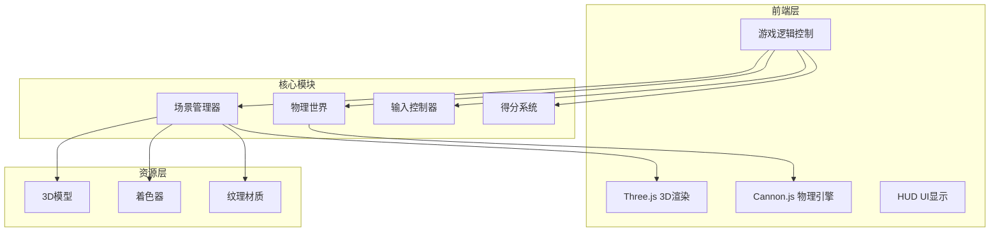

## 1. 架构设计

## 2. 技术描述

- **前端框架**：原生 JavaScript + Three.js (避免React，专注于3D性能)
- **构建工具**：Vite
- **3D引擎**：Three.js
- **物理引擎**：Cannon.js (轻量级，易于集成)
- **目录结构**：
  - `src/` - 源代码目录
    - `main.js` - 入口文件
    - `game/` - 游戏核心逻辑
    - `physics/` - 物理引擎相关
    - `renderer/` - Three.js渲染相关
  - `models/` - 3D模型文件
  - `shaders/` - 自定义着色器
  - `styles/` - CSS样式

## 3. 核心类设计

| 类名 | 用途 | 核心方法 |
|-------|---------|---------|
| PinballGame | 游戏主控制器 | init(), update(), reset() |
| SceneManager | 3D场景管理 | createScene(), addMesh(), removeMesh() |
| PhysicsWorld | 物理世界管理 | createWorld(), addBody(), step() |
| InputController | 输入控制 | handleKeyDown(), handleKeyUp() |
| ScoreManager | 得分管理 | addScore(), resetScore() |

## 4. 物理对象定义

### 4.1 弹珠 (Ball)
- 类型：Sphere
- 半径：0.3
- 质量：1
-  restitution：0.8 (高弹性)

### 4.2 挡板 (Flipper)
- 类型：Box
- 约束：HingeConstraint (铰链约束)
- 旋转角度：-30° 到 30°

### 4.3 保险杠 (Bumper)
- 类型：Cylinder 或 Sphere
- 质量：0 (静态)
- restitution：1.2 (超弹性反弹)

### 4.4 弹珠台 (Table)
- 类型：倾斜平面 + 边界墙
- 倾斜角度：6°
- 摩擦系数：0.3

## 5. 性能优化

- 物理步长：固定1/60秒
- 碰撞层优化：不同对象在不同碰撞层
- 休眠机制：静止物体进入休眠状态
- 渲染优化：复用几何体和材质
