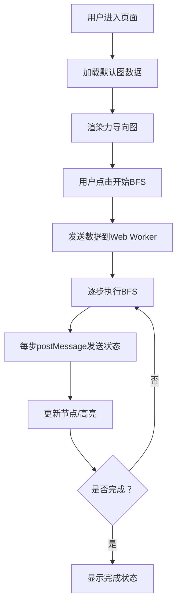

# 图搜索算法可视化 - 产品需求文档

## 1. 产品概述

图搜索算法可视化Web应用，帮助用户直观理解广度优先搜索（BFS）算法在图数据结构上的执行过程。

- 核心目标：通过动态可视化展示，降低算法学习门槛，让用户能够观察算法探索图的完整过程。

## 2. 核心功能

### 2.1 用户角色

| 角色 | 注册方式 | 核心权限 |
|------|----------|----------|
| 学习者 | 无需注册 | 使用全部功能 |

### 2.2 功能模块

1. **主页面**：力导向图可视化区域、算法控制面板、状态展示

### 2.3 页面详情

| 页面名称 | 模块名称 | 功能描述 |
|----------|----------|----------|
| 主页面 | 力导向图 | 使用D3.js渲染节点和边，支持力导向布局 |
| 主页面 | BFS算法控制 | 开始按钮、重置按钮、速度调节 |
| 主页面 | 状态展示 | 显示当前访问节点、已访问节点数量 |

## 3. 核心流程

用户点击"开始BFS"按钮 → Web Worker执行BFS算法 → 每步通过postMessage发送状态 → 主线程接收并更新可视化 → 已访问节点变色，当前节点高亮 → 算法完成后显示结果

## 4. 用户界面设计

### 4.1 设计风格

- **主色调**：深蓝色系（#165DFF）代表科技感
- **辅助色**：绿色（#00B42A）表示已访问，橙色（#FF7D00）表示当前节点
- **按钮风格**：圆角矩形，有悬停和点击效果
- **字体**：现代无衬线字体，清晰易读
- **布局风格**：左侧控制面板，右侧可视化区域的分栏布局
- **图标风格**：简洁线性图标

### 4.2 页面设计概述

| 页面名称 | 模块名称 | UI元素 |
|----------|----------|--------|
| 主页面 | 控制面板 | 标题、开始按钮、重置按钮、速度滑块、状态信息 |
| 主页面 | 可视化区域 | SVG画布、力导向图、节点动画效果 |

### 4.3 响应式

- Desktop-first设计
- 移动端适配：控制面板在上，可视化区域在下

### 4.4 交互细节

- 节点悬停效果
- 节点点击选中效果
- 平滑的颜色过渡动画
- 算法执行时的脉冲动画
