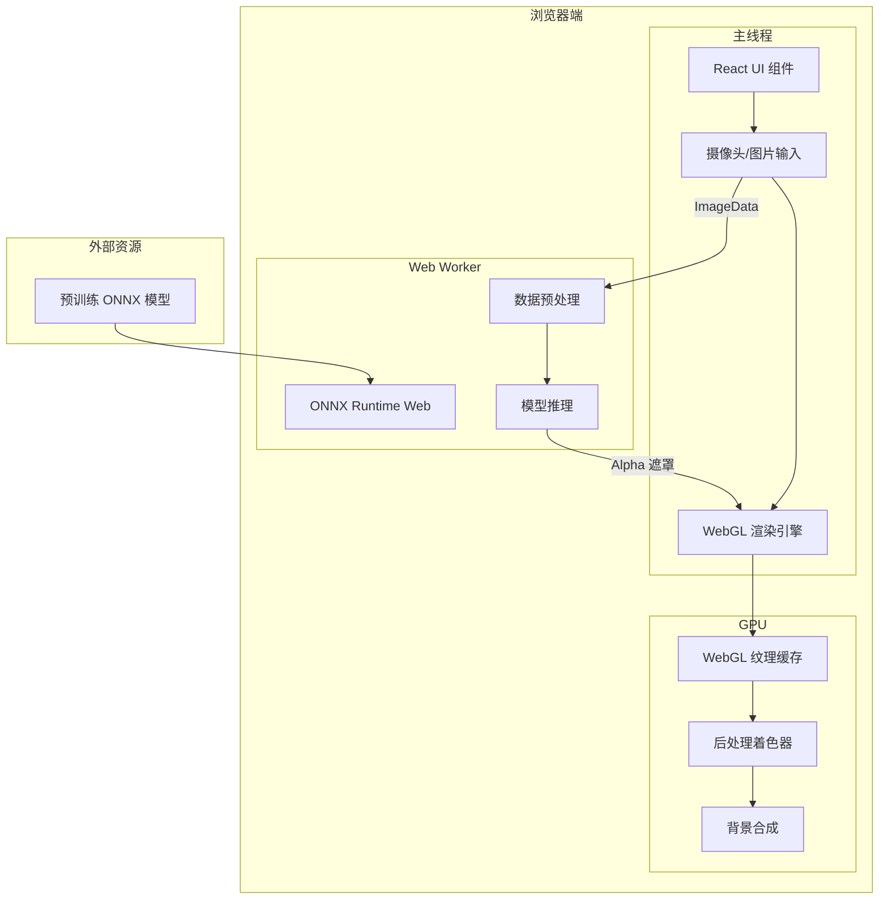
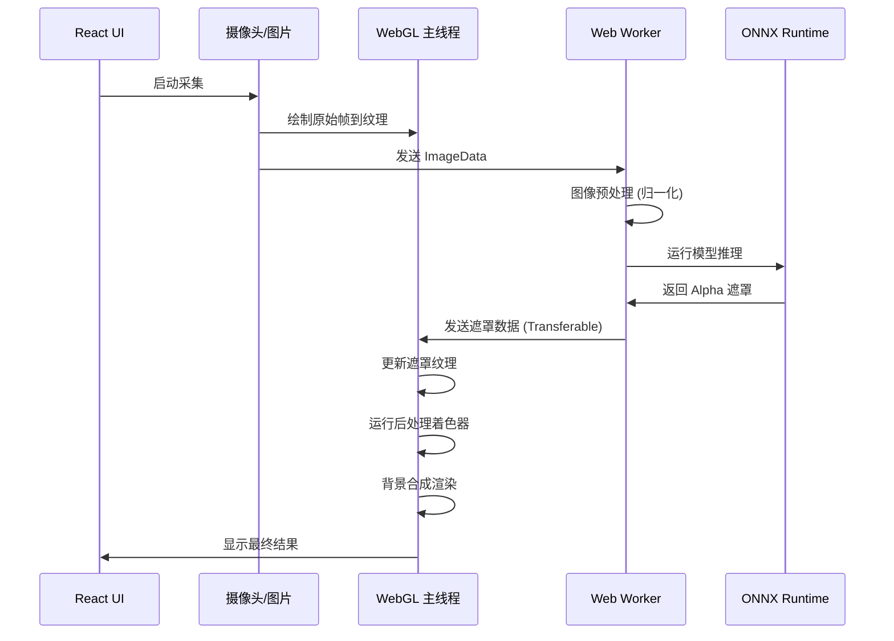

# 人像抠图工具 - 技术架构文档

## 1. 架构设计



## 2. 技术描述

- **前端框架**: React@18 + TypeScript@5
- **构建工具**: Vite@5
- **样式方案**: Tailwind CSS@3
- **AI推理**: ONNX Runtime Web@1.16
- **图形渲染**: WebGL 2.0
- **状态管理**: Zustand
- **图标库**: Lucide React

### 核心依赖说明

```json
{
  "dependencies": {
    "react": "^18.2.0",
    "react-dom": "^18.2.0",
    "onnxruntime-web": "^1.16.3",
    "zustand": "^4.4.7",
    "lucide-react": "^0.294.0"
  }
}
```

## 3. 目录结构

```
src/
├── components/
│   ├── PreviewCanvas.tsx      # WebGL预览画布
│   ├── ControlPanel.tsx       # 控制面板
│   ├── BackgroundSelector.tsx # 背景选择器
│   ├── PostProcessControls.tsx # 后处理控制
│   └── FileUpload.tsx         # 文件上传组件
├── hooks/
│   ├── useCamera.ts           # 摄像头hook
│   ├── useWebGL.ts            # WebGL管理hook
│   └── useSegmentation.ts     # 分割推理hook
├── workers/
│   └── segmentation.worker.ts # 推理Worker
├── utils/
│   ├── onnx.ts                # ONNX工具函数
│   ├── webgl.ts               # WebGL工具函数
│   └── image.ts               # 图像处理工具
├── shaders/
│   ├── vertex.glsl            # 顶点着色器
│   ├── composite.frag         # 合成片段着色器
│   ├── blur.frag              # 模糊后处理着色器
│   └── erodeDilate.frag       # 腐蚀膨胀着色器
├── store/
│   └── useAppStore.ts         # 全局状态
├── types/
│   └── index.ts               # 类型定义
├── App.tsx
└── main.tsx
```

## 4. 核心技术实现

### 4.1 WebGL 加速渲染

- 使用 WebGL 2.0 进行 GPU 加速的后处理
- 实现边缘羽化（高斯模糊）着色器
- 实现腐蚀膨胀形态学操作着色器
- 纹理缓存机制减少 CPU-GPU 数据传输

### 4.2 Web Worker 推理

- ONNX Runtime Web 在 Web Worker 中运行
- 模型加载和推理不阻塞 UI 线程
- 使用 Transferable Objects 传递 ArrayBuffer
- 消息队列处理推理请求

### 4.3 性能优化策略

- 推理分辨率 640x480，保证 >15fps
- 纹理复用避免频繁创建销毁
- 渲染帧率与推理帧率解耦
- 增量更新减少数据传输量

## 5. 核心数据流


