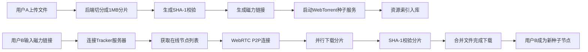

## 1. 产品概述

P2P CDN资源共享平台是一个基于WebTorrent协议的去中心化文件共享系统，用户可以上传文件生成磁力链接，其他用户通过P2P方式从多个节点并行下载分片，实现高效的内容分发。

- 解决传统CDN成本高、单点故障等问题，利用用户闲置带宽资源
- 目标用户：需要大文件分享、开源软件分发、媒体资源共享的用户群体

## 2. 核心功能

### 2.1 用户角色
| 角色 | 注册方式 | 核心权限 |
|------|---------|---------|
| 普通用户 | 无需注册 | 上传文件、下载文件、搜索资源 |

### 2.2 功能模块
1. **首页**：资源列表、热门资源、搜索框
2. **上传页面**：文件上传、分片进度、磁力链接生成
3. **下载页面**：磁力链接输入、下载进度、P2P节点状态
4. **资源详情页**：资源信息、分片状态、下载者列表

### 2.3 页面详情
| 页面名称 | 模块名称 | 功能描述 |
|---------|---------|---------|
| 首页 | 资源列表 | 按热度排序显示资源，支持搜索 |
| 首页 | 热门资源 | 展示下载量最高的TOP10资源 |
| 上传页面 | 文件上传 | 支持大文件拖拽上传，实时显示上传进度 |
| 上传页面 | 分片处理 | 1MB分片切割，SHA-1校验，生成磁力链接 |
| 下载页面 | 磁力解析 | 输入磁力链接或资源ID，解析资源信息 |
| 下载页面 | P2P下载 | WebRTC点对点传输，多节点并行下载 |
| 资源详情页 | 资源信息 | 文件大小、分片数量、哈希值、创建时间 |
| 资源详情页 | 节点状态 | 在线节点数、上传下载速度 |

## 3. 核心流程

## 4. 用户界面设计

### 4.1 设计风格
- **主色调**：深蓝色 (#165DFF) - 代表科技、信任
- **辅助色**：青色 (#00B42A) - 成功状态，橙色 (#FF7D00) - 警告状态
- **按钮风格**：圆角8px，渐变背景，悬停微动画
- **字体**：Inter - 现代无衬线字体
- **布局风格**：卡片式布局，毛玻璃效果，深色主题
- **图标风格**：线性图标，简洁现代

### 4.2 页面设计概述
| 页面名称 | 模块名称 | UI元素 |
|---------|---------|--------|
| 首页 | Hero区域 | 渐变背景，大标题，搜索框，浮动动画 |
| 首页 | 资源卡片 | 毛玻璃效果，悬浮放大动画，进度条展示 |
| 上传页面 | 上传区域 | 拖拽边框，脉冲动画，进度条 |
| 下载页面 | 节点状态 | 实时波形动画，节点连接可视化 |
| 全局 | 导航栏 | 毛玻璃效果，平滑滚动 |

### 4.3 响应式
- 桌面优先设计，自适应移动端
- 移动端单列布局，触摸友好
- 断点：1200px、768px、480px
