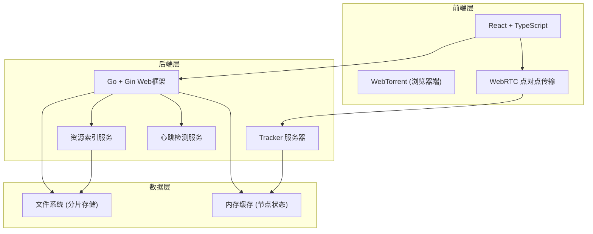
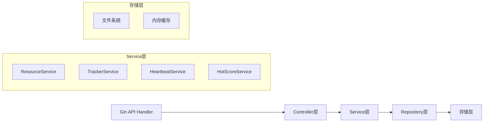
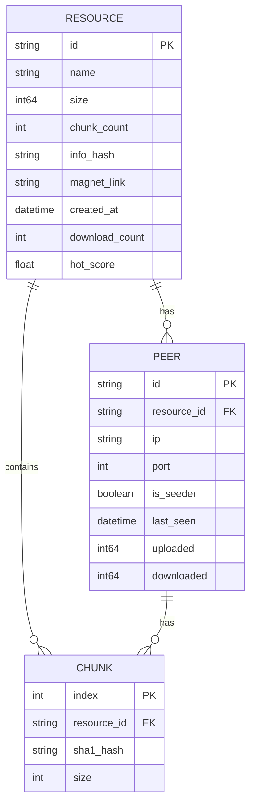

## 1. 架构设计



## 2. 技术描述

- **前端**：React@18 + TypeScript + Vite + TailwindCSS@3
- **初始化工具**：Vite
- **后端**：Go 1.21 + Gin Web框架
- **P2P协议**：WebTorrent + WebRTC
- **数据存储**：文件系统存储分片，内存缓存节点状态
- **哈希算法**：SHA-1 分片校验

## 3. 路由定义

### 前端路由
| 路由 | 用途 |
|------|------|
| / | 首页 - 资源列表和搜索 |
| /upload | 上传页面 - 文件上传和分片处理 |
| /download | 下载页面 - 磁力链接解析和下载 |
| /resource/:id | 资源详情页 |

### 后端API路由
| 路由 | 方法 | 用途 |
|------|------|------|
| /api/resource | POST | 上传文件创建资源 |
| /api/resource | GET | 获取资源列表 |
| /api/resource/:id | GET | 获取资源详情 |
| /api/resource/:id/chunks | GET | 获取分片信息 |
| /api/tracker/announce | GET | Tracker节点上报 |
| /api/tracker/scrape | GET | 获取节点列表 |
| /api/heartbeat | POST | 节点心跳 |

## 4. API 定义

```typescript
// 资源类型定义
interface Resource {
  id: string;
  name: string;
  size: number;
  chunkCount: number;
  chunkSize: number;
  infoHash: string;
  magnetLink: string;
  chunks: ChunkInfo[];
  createdAt: string;
  downloadCount: number;
  seeders: number;
  leechers: number;
  hotScore: number;
}

interface ChunkInfo {
  index: number;
  hash: string;
  size: number;
}

interface Peer {
  id: string;
  ip: string;
  port: number;
  isSeeder: boolean;
  lastSeen: string;
  downloaded: number;
  uploaded: number;
}

// 请求/响应定义
interface UploadResponse {
  success: boolean;
  resource: Resource;
  magnetLink: string;
}

interface AnnounceRequest {
  info_hash: string;
  peer_id: string;
  port: number;
  uploaded: number;
  downloaded: number;
  left: number;
  event: string;
}

interface AnnounceResponse {
  interval: number;
  peers: Peer[];
}
```

## 5. 服务端架构图



## 6. 数据模型

### 6.1 数据模型定义



### 6.2 热度排序算法
```
热度评分公式:
hotScore = (downloadCount * 0.6 + seeders * 0.3 + leechers * 0.1) / sqrt(hoursSinceCreated + 2)^1.5
```
