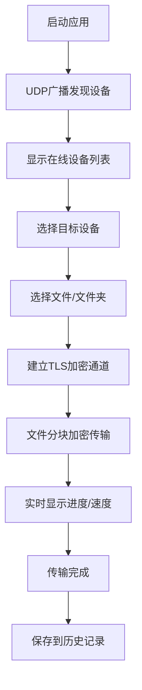

## 1. 产品概述

局域网文件传输工具是一款基于Tauri v2 + React + TypeScript开发的跨平台桌面应用，支持Windows/macOS/Linux系统。通过UDP广播自动发现同一子网内的在线设备，建立加密传输通道实现安全、高效的双向文件/文件夹传输。

- 核心价值：解决局域网内设备间文件传输繁琐、速度慢、不安全的痛点
- 目标用户：需要在多设备间快速共享大文件的开发者、设计师、办公人员
- 产品定位：轻量级、高性能、安全的局域网文件传输解决方案

## 2. 核心功能

### 2.1 功能模块

1. **设备发现页面**：自动扫描局域网内的在线设备，显示设备列表和状态
2. **文件传输页面**：选择文件/文件夹发送，查看传输任务列表和进度
3. **传输历史页面**：记录历史传输记录，支持重新发送和查看详情
4. **设置页面**：设备名称设置、传输路径配置、安全选项

### 2.2 页面详情

| 页面名称 | 模块名称 | 功能描述 |
|-----------|-------------|---------------------|
| 设备发现 | 设备扫描 | UDP广播自动发现，手动刷新设备列表 |
| 设备发现 | 设备卡片 | 显示设备名称、IP地址、在线状态、操作系统 |
| 文件传输 | 文件选择 | 支持拖拽上传、文件选择对话框、文件夹选择 |
| 文件传输 | 传输队列 | 显示当前传输任务、进度条、传输速度、剩余时间 |
| 文件传输 | 传输控制 | 暂停/继续传输、取消传输、断点续传 |
| 传输历史 | 历史记录 | 按时间排序显示所有传输记录，包括发送/接收 |
| 设置 | 基本设置 | 设备昵称、默认保存路径、自动接收开关 |
| 设置 | 安全设置 | 加密协议选择、设备验证、白名单管理 |

## 3. 核心流程

用户打开应用后，自动开始扫描局域网内的在线设备。选择目标设备后，可拖拽或选择文件进行发送。文件分块加密传输，实时显示进度和速度。接收方可以选择接受或拒绝文件传输请求。

## 4. 用户界面设计

### 4.1 设计风格

- **主题**：暗色主题，科技感十足的深色界面
- **主色调**：深蓝色系 (#165DFF)，代表科技、安全、可靠
- **辅助色**：青色 (#0FC6C2) 用于进度和成功状态，橙色 (#FF7D00) 用于警告
- **中性色**：深灰 (#121212) 背景，中灰 (#2A2A2A) 卡片，浅灰 (#8A8A8A) 文字
- **按钮风格**：圆角中等，悬浮时轻微放大+发光效果
- **字体**：JetBrains Mono 用于数字显示，Inter 用于正文
- **布局风格**：卡片式布局，左侧导航+右侧内容区域
- **图标风格**：Lucide 线性图标，简洁现代

### 4.2 页面设计概述

| 页面名称 | 模块名称 | UI Elements |
|-----------|-------------|-------------|
| 设备发现 | 设备扫描 | 扫描动画、状态指示灯、刷新按钮 |
| 设备发现 | 设备列表 | 网格布局卡片、悬停效果、连接按钮 |
| 文件传输 | 文件选择 | 拖拽区域、文件图标预览、大小显示 |
| 文件传输 | 传输队列 | 进度条动画、速度数字滚动、状态标签 |
| 设置 | 配置表单 | 开关组件、输入框、下拉选择、保存按钮 |

### 4.3 响应式设计

- 桌面端优先设计，最小窗口尺寸 1024x768
- 左侧导航栏在小窗口下可折叠为图标模式
- 传输队列支持竖向滚动，自适应高度
- 触摸设备优化：增大点击热区，优化滚动体验

## 5. 非功能需求

### 5.1 性能要求
- 设备发现响应时间 < 3秒
- 支持单文件最大 100GB 传输
- 传输速度接近网卡带宽上限（> 100MB/s 在千兆网络下）
- 同时支持最多 10 个并发传输任务

### 5.2 安全要求
- 使用 TLS 1.3 或 Noise 协议加密传输
- 文件分块校验，防止数据损坏
- 设备连接验证机制，防止未授权访问

### 5.3 可靠性要求
- 断点续传：网络中断后可恢复传输
- 异常退出后数据不丢失
- 传输完成自动校验文件完整性
