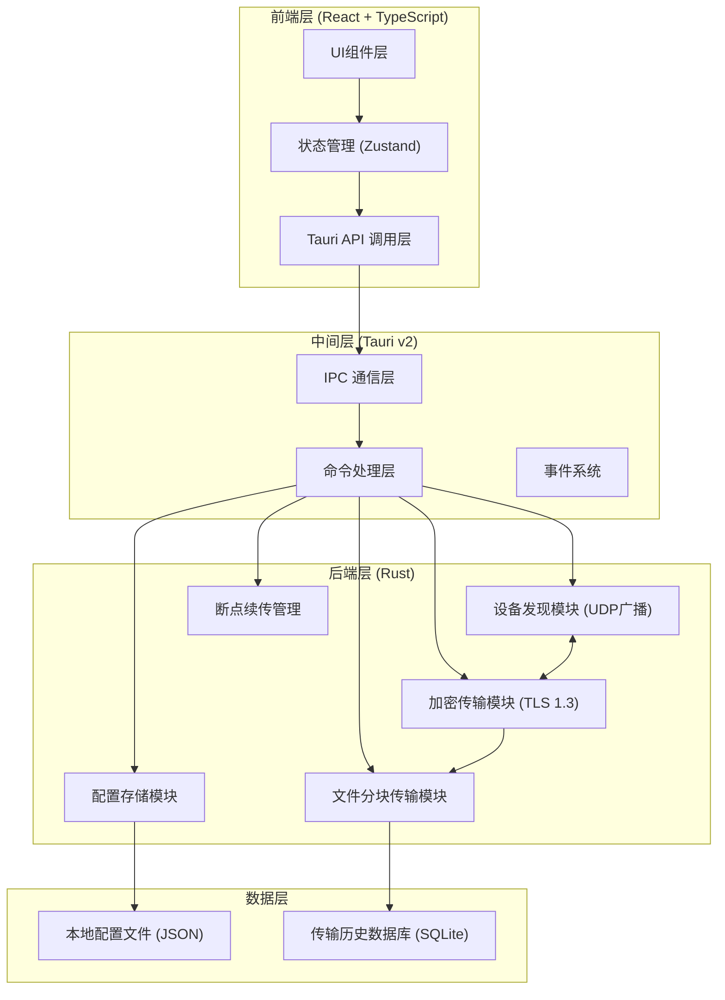
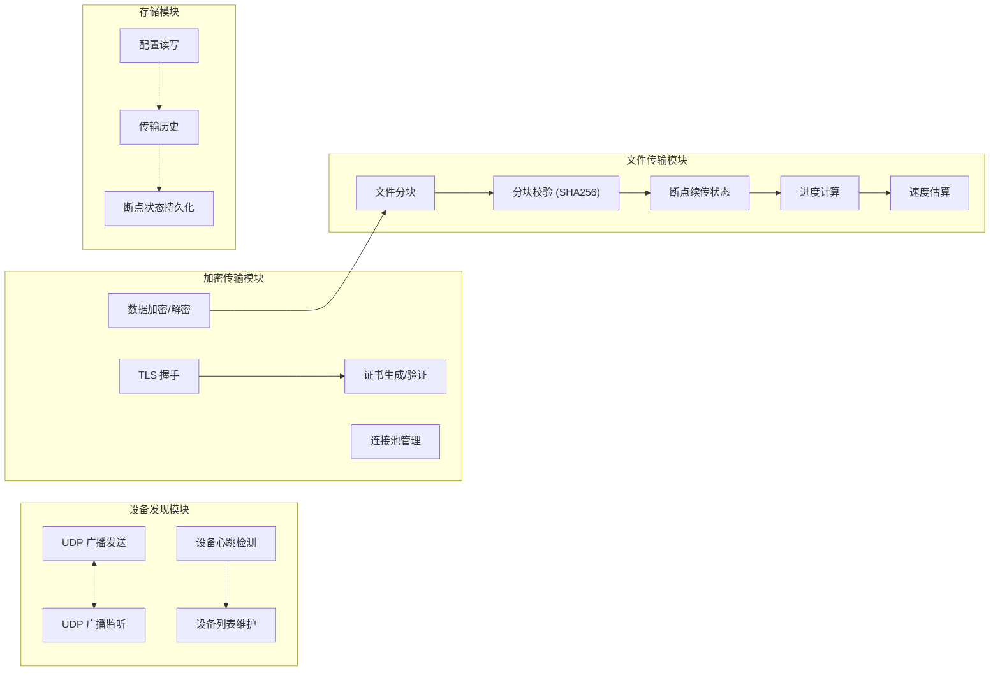

## 1. 架构设计



## 2. 技术栈说明

### 2.1 前端技术栈
- **框架**: React 18 + TypeScript
- **构建工具**: Vite 5
- **UI框架**: TailwindCSS 3.4
- **状态管理**: Zustand
- **图标库**: Lucide React
- **路由**: React Router DOM

### 2.2 后端技术栈 (Rust)
- **框架**: Tauri v2
- **网络**: Tokio 异步运行时
- **加密**: rustls (TLS 1.3)
- **文件处理**: tokio::fs
- **UDP广播**: std::net::UdpSocket
- **序列化**: serde + bincode
- **数据库**: rusqlite (SQLite)

### 2.3 跨平台支持
- Windows: 通过 Windows 套接字
- macOS: 通过 BSD 套接字
- Linux: 通过 POSIX 套接字

## 3. 路由定义

| 路由 | 页面名称 | 功能说明 |
|-------|---------|---------|
| / | 设备发现页 | 显示局域网内在线设备 |
| /transfer | 文件传输页 | 当前传输任务和队列 |
| /history | 传输历史页 | 历史传输记录 |
| /settings | 设置页 | 应用配置和选项 |

## 4. Rust 后端核心接口

### 4.1 Tauri 命令定义

```rust
// 设备发现
#[command]
async fn discover_devices() -> Result<Vec<DeviceInfo>, Error>

#[command]
async fn get_local_device_info() -> Result<DeviceInfo, Error>

// 文件传输
#[command]
async fn start_transfer(target_id: String, files: Vec<FileItem>) -> Result<String, Error>

#[command]
async fn pause_transfer(transfer_id: String) -> Result<(), Error>

#[command]
async fn resume_transfer(transfer_id: String) -> Result<(), Error>

#[command]
async fn cancel_transfer(transfer_id: String) -> Result<(), Error>

// 设置
#[command]
async fn save_settings(settings: AppSettings) -> Result<(), Error>

#[command]
async fn load_settings() -> Result<AppSettings, Error>
```

### 4.2 Tauri 事件定义

```rust
// 前端监听的事件
pub enum TransferEvent {
    Progress { transfer_id: String, bytes_transferred: u64, total_bytes: u64 },
    Speed { transfer_id: String, bytes_per_second: f64 },
    Completed { transfer_id: String },
    Failed { transfer_id: String, error: String },
    DeviceDiscovered { device: DeviceInfo },
    DeviceOffline { device_id: String },
    TransferRequest { from_device: DeviceInfo, files: Vec<FileItem> },
}
```

### 4.3 TypeScript 类型定义

```typescript
interface DeviceInfo {
  id: string;
  name: string;
  ip: string;
  port: number;
  os: 'windows' | 'macos' | 'linux';
  status: 'online' | 'offline' | 'connecting';
  lastSeen: number;
}

interface FileItem {
  id: string;
  name: string;
  path: string;
  size: number;
  type: 'file' | 'folder';
}

interface TransferTask {
  id: string;
  direction: 'send' | 'receive';
  peerDevice: DeviceInfo;
  files: FileItem[];
  totalSize: number;
  transferredSize: number;
  speed: number;
  status: 'pending' | 'transferring' | 'paused' | 'completed' | 'failed' | 'cancelled';
  startTime: number;
  endTime?: number;
}

interface AppSettings {
  deviceName: string;
  savePath: string;
  autoAccept: boolean;
  maxConcurrentTransfers: number;
  enableEncryption: boolean;
  whitelist: string[];
}
```

## 5. 核心模块架构



## 6. 通信协议设计

### 6.1 设备发现协议
- 广播端口: 58777
- 广播间隔: 2秒
- 超时时间: 10秒未收到心跳标记为离线

### 6.2 数据传输协议
- 控制端口: 58778
- 数据端口: 58779 (动态分配)
- 分块大小: 1MB (1048576字节)
- 协议格式: 消息头(8字节) + 消息体(变长)

### 6.3 断点续传
- 每个传输任务生成唯一ID
- 断点信息存储在 SQLite 中
- 恢复时校验已接收分块的哈希值
- 从未完成的分块继续传输

## 7. 项目目录结构

```
e55/
├── src/                          # 前端源码
│   ├── components/              # 可复用组件
│   │   ├── DeviceCard.tsx
│   │   ├── TransferProgress.tsx
│   │   ├── FileDropZone.tsx
│   │   └── Sidebar.tsx
│   ├── pages/                   # 页面组件
│   │   ├── Devices.tsx
│   │   ├── Transfer.tsx
│   │   ├── History.tsx
│   │   └── Settings.tsx
│   ├── hooks/                   # 自定义 Hooks
│   │   ├── useDeviceDiscovery.ts
│   │   ├── useTransfer.ts
│   │   └── useSettings.ts
│   ├── store/                   # 状态管理
│   │   └── index.ts
│   ├── types/                   # 类型定义
│   │   └── index.ts
│   ├── utils/                   # 工具函数
│   │   └── format.ts
│   ├── App.tsx
│   ├── main.tsx
│   └── index.css
├── src-tauri/                   # Rust 后端
│   ├── src/
│   │   ├── commands/           # Tauri 命令
│   │   │   ├── device.rs
│   │   │   ├── transfer.rs
│   │   │   └── settings.rs
│   │   ├── discovery/          # 设备发现
│   │   │   ├── udp_broadcast.rs
│   │   │   └── device_manager.rs
│   │   ├── transfer/           # 文件传输
│   │   │   ├── protocol.rs
│   │   │   ├── encryption.rs
│   │   │   ├── chunked_transfer.rs
│   │   │   └── resume.rs
│   │   ├── storage/            # 数据存储
│   │   │   ├── config.rs
│   │   │   └── history.rs
│   │   ├── models/             # 数据模型
│   │   │   ├── device.rs
│   │   │   ├── file.rs
│   │   │   └── transfer.rs
│   │   ├── error.rs
│   │   └── main.rs
│   ├── Cargo.toml
│   └── tauri.conf.json
├── package.json
├── tsconfig.json
├── vite.config.ts
├── tailwind.config.js
└── postcss.config.js
```
