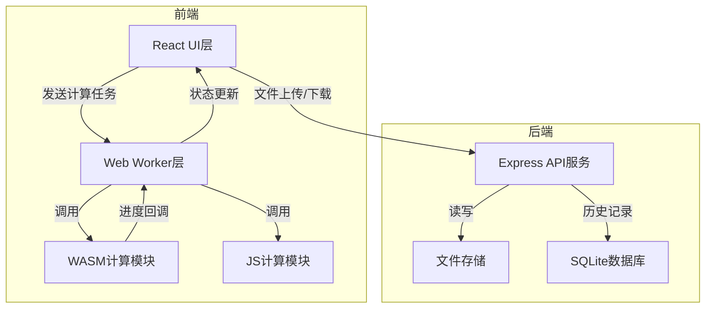

## 1. 架构设计



## 2. 技术描述

- **前端**: React@18 + TypeScript + Vite
- **样式**: TailwindCSS@3 + TailwindCSS
- **WASM**: Rust + wasm-pack + wasm-bindgen + rayon(并行计算)
- **图表**: ECharts@5
- **Worker**: Web Worker + Comlink
- **后端**: Express@4 + TypeScript
- **数据库**: SQLite + better-sqlite3
- **文件处理**: PapaParse (CSV) + parquet-wasm (Parquet)

## 3. 目录结构

```
e62/
├── frontend/
│   ├── src/
│   │   ├── components/    # React组件
│   │   ├── workers/        # Web Worker
│   │   ├── utils/         # 工具函数
│   │   ├── types/         # TypeScript类型
│   │   └── wasm/          # WASM模块
│   └── package.json
├── wasm/
│   ├── src/
│   │   ├── lib.rs        # Rust主入口
│   │   ├── csr.rs        # CSR矩阵实现
│   │   └── multiply.rs   # 并行乘法算法
│   └── Cargo.toml
├── backend/
│   ├── src/
│   │   ├── controllers/   # 控制器
│   │   ├── models/        # 数据模型
│   │   └── routes/        # 路由
│   └── package.json
└── package.json
```

## 4. 核心数据结构

### 4.1 CSR稀疏矩阵格式

```typescript
interface CSRMatrix {
  rows: number;           // 行数
  cols: number;           // 列数
  indptr: Uint32Array;    // 行指针数组
  indices: Uint32Array;   // 列索引数组
  data: Float64Array;    // 非零元素值数组
  nnz: number;            // 非零元素数量
}
```

### 4.2 计算任务

```typescript
interface ComputeTask {
  id: string;
  matrixA: CSRMatrix;
  matrixB: CSRMatrix;
  engine: 'js' | 'wasm';
  threadCount?: number;
  timestamp: number;
}

interface ComputeResult {
  taskId: string;
  matrixC: CSRMatrix;
  duration: number;
  memoryUsage: {
    peak: number;
    timeline: Array<{ time: number; memory: number }>;
  };
  progress: Array<{ time: number; value: number }>;
}
```

## 5. API 定义

### 5.1 矩阵管理

```typescript
// 保存矩阵
POST /api/matrices
Request: { name: string; matrix: CSRMatrix }
Response: { id: string; success: boolean }

// 获取矩阵
GET /api/matrices/:id
Response: { id: string; name: string; matrix: CSRMatrix }

// 矩阵列表
GET /api/matrices
Response: Array<{ id: string; name: string; createdAt: string; size: number }>
```

### 5.2 计算历史

```typescript
// 保存计算记录
POST /api/history
Request: { matrixAId: string; matrixBId: string; resultId: string; engine: string; duration: number }

// 获取历史记录
GET /api/history
Response: Array<{
  id: string;
  matrixA: { name: string; size: string };
  matrixB: { name: string; size: string };
  engine: string;
  duration: number;
  createdAt: string;
}>
```

## 6. 性能优化策略

### 6.1 WASM 优化
- 使用 TypedArray 直接内存访问，避免拷贝
- Rayon 数据并行计算
- 内存池重用，避免频繁分配
- SIMD 指令优化（可选）

### 6.2 前端优化
- Web Worker 后台计算，不阻塞UI
- 增量进度更新，避免频繁重绘
- 虚拟列表处理大数据
- WebGL 矩阵可视化（可选）

## 7. Rust 依赖说明

```toml
# Cargo.toml
[dependencies]
wasm-bindgen = "0.2"
wasm-bindgen-rayon = "1.0"
rayon = "1.7"
web-sys = { version = "0.3", features = ["console"] }
serde = { version = "1.0", features = ["derive"] }
serde-wasm-bindgen = "0.5"
js-sys = "0.3"
```
