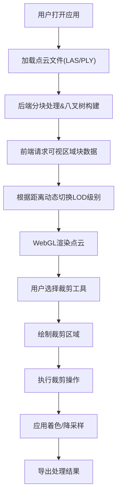

## 1. 产品概述

基于Three.js + WebGL的高性能点云渲染编辑器，支持千万级点云数据的实时渲染与交互编辑。通过八叉树+LOD技术实现动态加载，提供专业的点云处理工具集，适用于测绘、BIM、三维重建等领域。

- 核心价值：解决大数量级点云渲染性能瓶颈，提供便捷的点云编辑处理能力
- 目标用户：测绘工程师、BIM设计师、三维重建研究人员

## 2. 核心功能

### 2.1 用户角色

| 角色 | 注册方式 | 核心权限 |
|------|---------|---------|
| 普通用户 | 无需注册 | 本地文件加载、基础编辑功能 |

### 2.2 功能模块

1. **主编辑器页面**：3D视口、工具栏、侧边控制面板、状态栏
2. **文件管理模块**：LAS/PLY格式文件加载、分块存储管理
3. **渲染引擎模块**：八叉树空间划分、LOD动态加载、WebGL渲染优化
4. **裁剪工具模块**：矩形选择、球形选择、多边形选择区域裁剪
5. **点云处理模块**：降采样、高程着色、强度着色、RGB着色

### 2.3 页面详情

| 页面名称 | 模块名称 | 功能描述 |
|---------|---------|---------|
| 主编辑器 | 3D视口 | Three.js渲染场景，支持旋转、缩放、平移操作 |
| 主编辑器 | 工具栏 | 文件操作、裁剪工具、着色模式切换、降采样按钮 |
| 主编辑器 | 侧边面板 | 点云信息展示、渲染参数调整、工具属性配置 |
| 主编辑器 | 状态栏 | 显示当前点数、帧率、内存使用等性能指标 |

## 3. 核心流程

## 4. 用户界面设计

### 4.1 设计风格
- **主色调**：深海军蓝 #0F172A（专业、科技感）
- **强调色**：青色 #06B6D4（交互元素）
- **辅助色**：橙色 #F97316（警告/操作按钮）
- **按钮风格**：圆角8px，悬停有微妙阴影和颜色渐变
- **字体**：JetBrains Mono（等宽字体，适合技术应用） + Noto Sans SC
- **布局风格**：深色主题三栏布局，顶部工具栏，左侧工具面板，右侧属性面板，中央3D视口
- **图标风格**：Lucide图标，线性风格

### 4.2 页面设计概述

| 页面名称 | 模块名称 | UI元素 |
|---------|---------|--------|
| 主编辑器 | 3D视口 | 深色背景，网格辅助线，坐标轴指示器，FPS计数器 |
| 主编辑器 | 工具栏 | 图标按钮组，分隔线，下拉菜单，工具状态指示 |
| 主编辑器 | 侧边面板 | 可折叠面板组，滑块控件，颜色选择器，数据表格 |
| 主编辑器 | 状态栏 | 信息图标，数值显示，进度条指示器 |

### 4.3 响应式
- 桌面端优先，支持1920×1080及以上分辨率
- 侧边面板可折叠以扩大视口区域
- 工具栏在小屏幕下转为图标+tooltip模式

### 4.4 3D场景指引
- **环境**：深色渐变背景，灰色地面网格
- **光照**：环境光+方向光，避免过度照明影响点云颜色
- **相机**：透视相机，默认轨道控制器，支持阻尼效果
- **交互**：鼠标左键旋转，右键平移，滚轮缩放
- **后处理**：FXAA抗锯齿，可选点精灵大小调整
