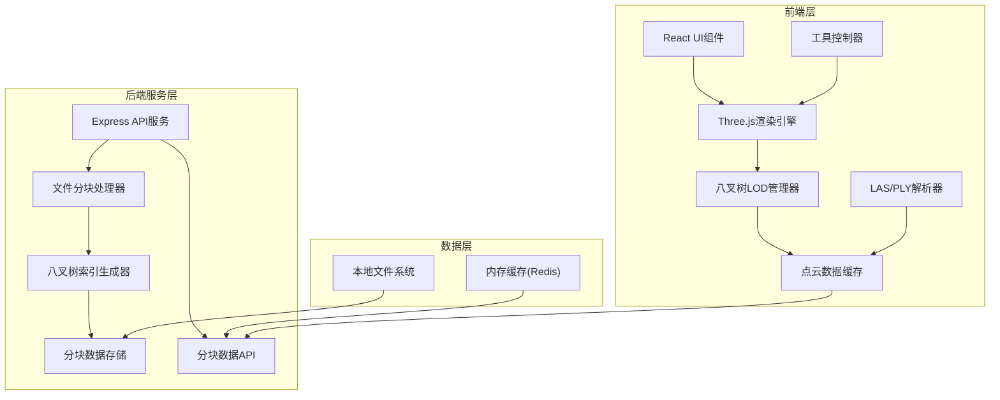
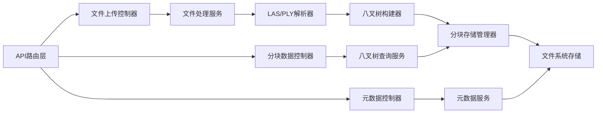
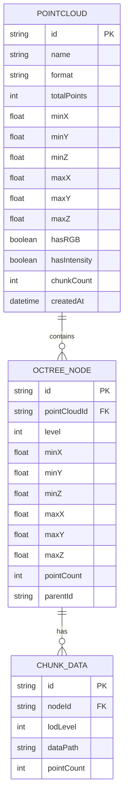

## 1. 架构设计



## 2. 技术描述

- **前端**: React@18 + TypeScript + Vite + TailwindCSS@3
- **状态管理**: Zustand
- **3D引擎**: three@0.160 + @react-three/fiber@8 + @react-three/drei@9
- **后端**: Express@4 + TypeScript
- **文件解析**: lasply + three.js内置PLY加载器
- **性能优化**: WebWorker + 分块加载 + 八叉树空间索引

## 3. 路由定义

| 路由 | 用途 |
|------|------|
| / | 主编辑器页面 |
| /api/pointcloud/upload | 点云文件上传接口 |
| /api/pointcloud/:id/chunks | 获取分块数据 |
| /api/pointcloud/:id/metadata | 获取点云元数据 |

## 4. API定义

### 4.1 类型定义

```typescript
// 点云元数据
interface PointCloudMetadata {
  id: string;
  name: string;
  format: 'las' | 'ply';
  totalPoints: number;
  bounds: {
    min: [number, number, number];
    max: [number, number, number];
  };
  hasRGB: boolean;
  hasIntensity: boolean;
  chunkCount: number;
}

// 八叉树节点
interface OctreeNode {
  id: string;
  level: number;
  bounds: {
    min: [number, number, number];
    max: [number, number, number];
  };
  pointCount: number;
  children: string[];
  lodLevels: number[];
}

// 分块数据
interface PointCloudChunk {
  nodeId: string;
  lodLevel: number;
  positions: Float32Array;
  colors?: Float32Array;
  intensities?: Float32Array;
  pointCount: number;
}

// 裁剪区域
interface ClipRegion {
  type: 'rectangle' | 'sphere' | 'polygon';
  parameters: any;
  inverse: boolean;
}
```

### 4.2 请求响应

```typescript
// POST /api/pointcloud/upload
// Request: multipart/form-data
// Response: PointCloudMetadata

// GET /api/pointcloud/:id/metadata
// Response: PointCloudMetadata

// GET /api/pointcloud/:id/chunks?lodLevel=2&bbox=...
// Response: PointCloudChunk[]
```

## 5. 服务器架构



## 6. 数据模型

### 6.1 数据模型定义



### 6.2 文件存储结构

```
data/
└── pointclouds/
    └── {pointcloud-id}/
        ├── metadata.json
        ├── octree.json
        └── chunks/
            ├── level-0/
            │   └── {node-id}.bin
            ├── level-1/
            └── level-2/
```
