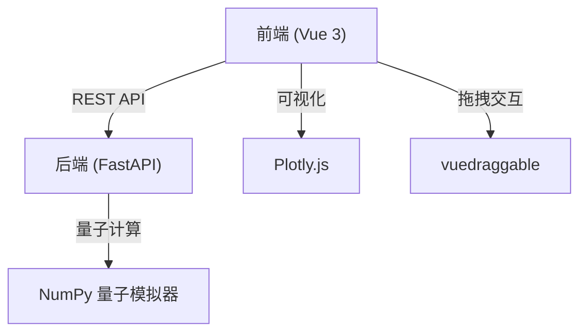
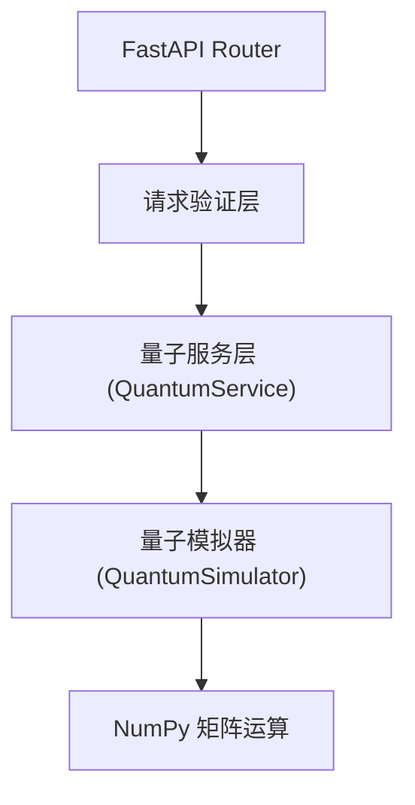

## 1. 架构设计



## 2. 技术描述

- 前端：Vue 3 + Vite + TypeScript
- 状态管理：Vue Composition API (Pinia 可选)
- 可视化：Plotly.js
- 拖拽：vuedraggable (Sortable.js)
- 样式：TailwindCSS 3
- 后端：Python 3.10+ + FastAPI + Uvicorn
- 数值计算：NumPy
- 跨域：FastAPI CORS 中间件

## 3. 目录结构

```
e95/
├── backend/
│   ├── main.py           # FastAPI 应用入口
│   ├── quantum_sim.py    # 量子模拟器核心逻辑
│   ├── requirements.txt  # Python 依赖
│   └── .gitignore
├── frontend/
│   ├── src/
│   │   ├── components/
│   │   │   ├── GateToolbar.vue    # 量子门工具箱
│   │   │   ├── CircuitCanvas.vue  # 电路画布
│   │   │   ├── StatePlot.vue      # 态矢量图表
│   │   │   ├── ControlPanel.vue   # 控制面板
│   │   │   └── MeasureResult.vue  # 测量结果
│   │   ├── composables/
│   │   │   └── useQuantumAPI.ts   # API 调用封装
│   │   ├── types/
│   │   │   └── quantum.ts         # 类型定义
│   │   ├── App.vue
│   │   ├── main.ts
│   │   └── style.css
│   ├── index.html
│   ├── package.json
│   ├── vite.config.ts
│   ├── tsconfig.json
│   └── tailwind.config.js
└── README.md
```

## 4. API 定义

### 4.1 类型定义

```typescript
type GateType = 'H' | 'X' | 'Y' | 'S' | 'T' | 'CNOT';

interface Gate {
  type: GateType;
  qubit: number;          // 目标量子比特
  control?: number;       // 控制量子比特 (仅 CNOT)
  step: number;           // 时间步位置
}

interface StateVector {
  state: Complex[];       // 态矢量
  numQubits: number;
  basisStates: string[];  // 基态标签 |000>, |001>, ...
}

interface Complex {
  real: number;
  imag: number;
}

interface MeasureResult {
  qubit: number;
  result: 0 | 1;
  collapsedState: Complex[];
  probabilities: number[];
}
```

### 4.2 接口定义

| 方法 | 路径 | 请求体 | 响应 | 描述 |
|------|------|--------|------|------|
| POST | /apply_gate | `{ gate: GateType, qubit: number, control?: number, state?: Complex[] }` | `StateVector` | 应用单个量子门 |
| POST | /measure | `{ qubit: number, state?: Complex[] }` | `MeasureResult` | 测量指定量子比特 |
| GET | /state_vector | `?numQubits=3` | `StateVector` | 获取初始态矢量 |
| POST | /run_circuit | `{ gates: Gate[], numQubits: number }` | `StateVector` | 运行完整电路 |
| POST | /reset | `{ numQubits: number }` | `StateVector` | 重置为 |0> 态 |

## 5. 后端架构



### 5.1 核心类设计

```python
class QuantumSimulator:
    def __init__(self, num_qubits: int):
        self.num_qubits = num_qubits
        self.state = self._initialize_state()
    
    def _initialize_state(self) -> np.ndarray:
        # 返回 |00...0> 态
    
    def apply_gate(self, gate: str, qubit: int, control: int = None):
        # 应用单量子门或 CNOT 门
        # 使用 Kronecker 积构造完整矩阵
    
    def measure(self, qubit: int) -> Tuple[int, np.ndarray]:
        # 测量量子比特，返回结果和坍缩后的态
    
    def get_state_vector(self) -> List[Dict]:
        # 返回复数形式的态矢量
    
    @staticmethod
    def get_gate_matrix(gate: str) -> np.ndarray:
        # 返回各量子门的矩阵表示
        # H, X, Y, S, T, CNOT
```

## 6. 前端状态管理

使用 Vue Composition API 的 ref/reactive 管理：

```typescript
// 电路状态
const numQubits = ref(3);
const circuitGates = ref<Gate[]>([]);
const currentStep = ref(0);

// 模拟器状态
const stateVector = ref<StateVector | null>(null);
const measureHistory = ref<MeasureResult[]>([]);
const isRunning = ref(false);
```

## 7. 量子门矩阵定义

| 门 | 矩阵表示 |
|----|----------|
| H | `1/√2 * [[1, 1], [1, -1]]` |
| X | `[[0, 1], [1, 0]]` |
| Y | `[[0, -i], [i, 0]]` |
| S | `[[1, 0], [0, i]]` |
| T | `[[1, 0], [0, e^(iπ/4)]]` |
| CNOT | `[[1,0,0,0],[0,1,0,0],[0,0,0,1],[0,0,1,0]]` |
